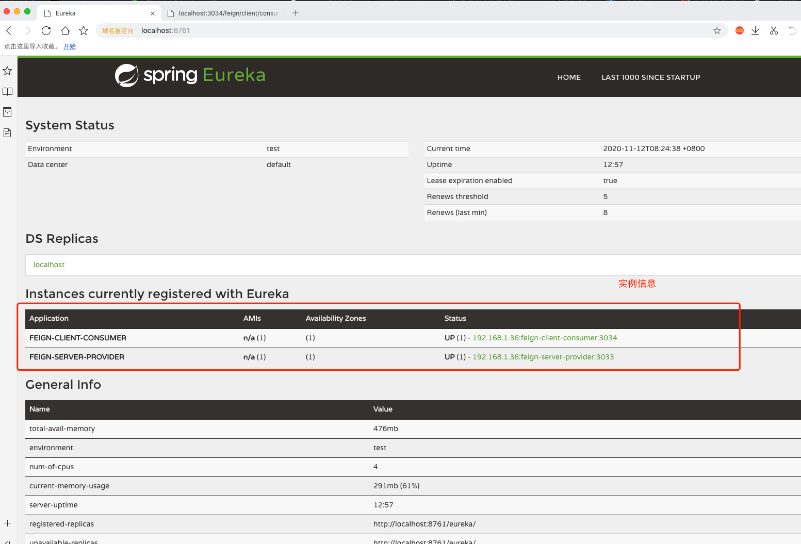
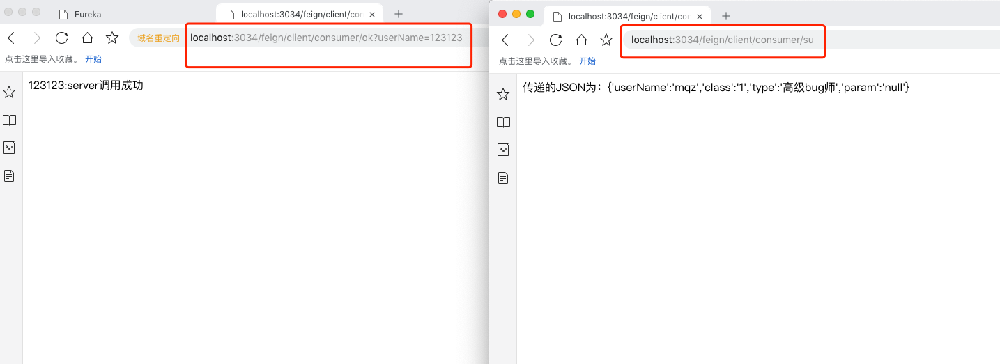
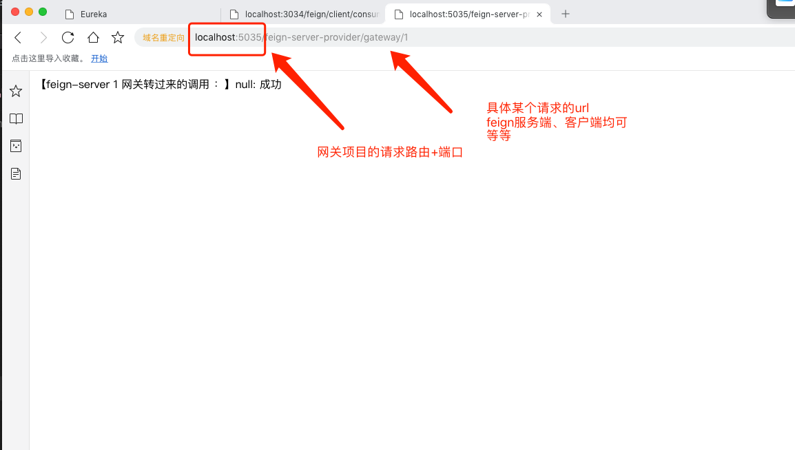

#【Feign+Eureka实现服务之间的调用，RB】
    两个服务提供方注册到注册中心，feign调用默认会使用轮询负载
    
    
    这Feign+Eureka总共有三个项目：
        feign-client-consumer: 服务消费方
            1、需要开启Eureka Client配置
            2、需要开启Feign Client配置
            3、需要定义本地代理接口，该代理接口需要和服务提供方的controller接口保持保持一致，并且接口url要匹配
            4、调用服务提供方按照服务注册中心的名字进行调用，不要写ip+端口（这样是不会有RB的效果）
        feign-server-provider: 服务提供方
            1、需要开启Eureka Client配置，需要把服务注册到eureka中
        feign-server-provider-two: 服务提供方2
            1、需要开启Eureka Client配置，需要把服务注册到eureka中
        feign-eureka: 服务注册中心
            1、需要开Eureka Server配置
        feign-eureka-gateway: 网关
            1、需要注册到eureka
            2、配置网关请求过滤路由
            3、所有请求均请求该网关
            

            

    
    

 
